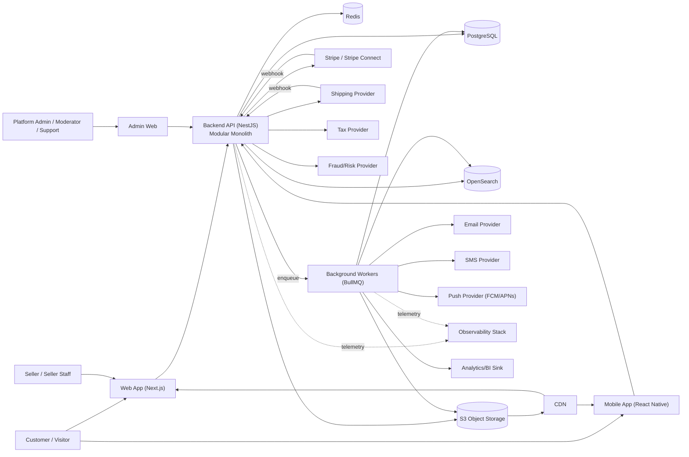

# System Context

## 1. Actors

| Actor | Description | Trust Level | Primary Interfaces |
|---|---|---|---|
| Customer | Registered or guest buyer | Untrusted (external) | Web, Mobile, Public API |
| Seller (business owner) | Owns a Seller Organization/storefront | Untrusted (external), elevated within own tenant | Web (seller portal), Public API |
| Seller Staff | Employee/collaborator under a Seller Organization | Untrusted (external), scoped permissions | Web (seller portal) |
| Platform Administrator | Anthropic-marketplace-operator staff with full platform authority | Trusted (internal) | Admin Web |
| Moderator | Reviews listings/content/reviews for policy violations | Trusted (internal), scoped | Admin Web |
| Support Personnel | Customer/seller support, limited order/account intervention | Trusted (internal), scoped | Admin Web |
| Unauthenticated Visitor | Browses catalog/search without an account | Untrusted (external) | Web, Mobile |

## 2. External Systems

| System | Purpose | Direction | Auth Mechanism | Data Exchanged | Sensitivity | Failure Implication |
|---|---|---|---|---|---|---|
| Stripe (+ Stripe Connect) | Payment capture, refunds, seller payouts | Outbound calls + inbound webhooks | API secret key (backend-held); webhook signature verification | Payment intents, charge/refund references, Connect account IDs — **no raw card data** | Critical/financial | Checkout degrades to "payment temporarily unavailable"; existing orders unaffected |
| Shipping provider(s) (e.g., EasyPost/Shippo-class aggregator) | Rate quotes, label generation, tracking | Outbound calls + inbound tracking webhooks | API key | Addresses, package dimensions, tracking numbers | Moderate (PII: addresses) | Checkout falls back to flat-rate/estimated shipping; fulfillment queues for manual labeling |
| Tax provider (e.g., Avalara-class) | Tax calculation by jurisdiction | Outbound calls | API key | Order line items, addresses (no payment data) | Moderate (PII: addresses) | Falls back to configured static tax tables; flagged for reconciliation |
| Email provider (e.g., SES/Postmark-class) | Transactional email delivery | Outbound calls | API key | Email address, template data | Moderate (PII) | Notification queued for retry; does not block order/payment completion |
| SMS provider (e.g., Twilio-class) | Transactional SMS (OTP, shipment alerts) | Outbound calls | API key | Phone number, message content | Moderate (PII) | Same as email — retried, non-blocking |
| Push notification provider (FCM/APNs) | Mobile push | Outbound calls | Service credentials/certs | Device token, payload | Low/Moderate | Retried, non-blocking |
| Object Storage (S3-compatible) | Durable storage for product media, exports, backups | Bidirectional (signed URLs) | IAM role / signed URL | Media files, generated documents | Varies (public product images = low; export files = moderate) | Uploads/downloads fail gracefully with retry; CDN serves cached copies during transient outage |
| CDN | Edge delivery of static assets and media | Read-through of S3 | Origin access control | Cached media/static assets | Low | Falls back to origin fetch; degraded latency only |
| Fraud/risk signal provider (optional, e.g., Stripe Radar or dedicated vendor) | Risk scoring for orders/accounts | Outbound calls | API key | Order/account risk attributes (no raw PANs) | Moderate | Falls back to internal heuristic rules; higher manual review rate |
| Analytics/BI sink (e.g., warehouse via CDC or event export) | Downstream reporting | Outbound (async, batched) | Service credentials | De-identified/aggregated business events | Low–Moderate | Analytics latency increases; never blocks transactional paths |

## 3. Internal Systems

| System | Purpose | Trust Level |
|---|---|---|
| Web Application (Next.js) | Customer + seller storefront/portal UI | Untrusted client, calls trusted backend |
| Mobile Applications (React Native/Expo) | Customer (and optionally seller) mobile UI | Untrusted client |
| Admin Web Application | Internal operator/moderator/support UI | Trusted client, still authenticated/authorized server-side |
| Public API (NestJS backend) | Single authoritative API surface for all clients | Trusted server boundary |
| PostgreSQL | Authoritative transactional datastore | Trusted, private network only |
| Redis | Cache, sessions, rate limiting, queues, locks | Trusted, private network only |
| OpenSearch | Derived product/catalog search index | Trusted, private network only |
| Background Workers (BullMQ consumers) | Async processing: indexing, notifications, media, reconciliation | Trusted |
| Observability stack (OTel/Prometheus/Grafana/Loki/Tempo) | Telemetry collection and visualization | Trusted, internal only |

## 4. System Context Diagram

## 5. Trust Boundary Summary

- **Boundary 1 — Public Internet ↔ Edge/CDN/Web-Mobile clients:** no trust; all input treated as hostile.
- **Boundary 2 — Clients ↔ Backend API:** the only crossing point from untrusted to trusted; enforced via TLS, authentication, and authorization on every request.
- **Boundary 3 — Backend ↔ Data stores (Postgres/Redis/OpenSearch):** private network only, no direct client or internet access, service-level credentials.
- **Boundary 4 — Backend/Workers ↔ External providers:** outbound calls use provider SDKs with least-privilege API keys; inbound webhooks are treated as untrusted input requiring signature verification before use.
- **Boundary 5 — Admin Web ↔ Backend API:** same API surface as customer/seller clients but under stricter authorization policies (see `08-auth-architecture.md`) and full audit logging (see `25-administration-architecture.md`).
