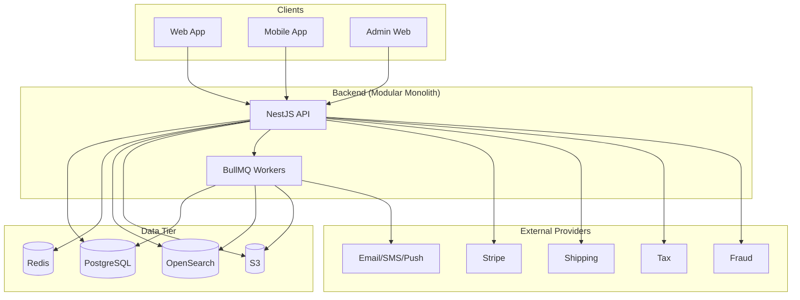

# Component / Container Architecture

## 1. Decomposition Approach

The platform begins as a **modular monolith** (see ADR-0001): one deployable NestJS backend application internally organized into strictly bounded domain modules, plus separately deployable background workers sharing the same codebase and domain layer. This gives strong initial consistency and low operational overhead while preserving explicit module boundaries that allow later extraction of individual domains into standalone services without a rewrite.

## 2. Major Components

### 2.1 Web Application (Next.js)
- **Responsibility:** Customer storefront (browse/search/cart/checkout/account) and Seller Portal (catalog/inventory/orders/analytics management), rendered via Next.js App Router with server components for SEO-critical pages and client components for interactive flows.
- **Owned data:** None authoritative — all state is server state (via API) or ephemeral client state (form input, UI state).
- **Dependencies:** Backend Public API, CDN for media.
- **Scaling:** Stateless; horizontally scaled behind CDN/edge; SSR pages cached where safe.
- **Failure behavior:** Degrades to client-rendered error boundaries with retry; never assumes backend availability.
- **Security boundary:** Untrusted client. No authorization decisions trusted from this tier.

### 2.2 Mobile Applications (React Native/Expo)
- **Responsibility:** Customer mobile shopping experience; optional seller companion features.
- **Owned data:** None authoritative — local secure storage only for tokens/cached UI state.
- **Dependencies:** Backend Public API, push notification provider.
- **Scaling:** N/A (client).
- **Failure behavior:** Offline-tolerant read caching for catalog browsing; all writes require connectivity and are queued/retried client-side, never assumed successful until server-confirmed.

### 2.3 Admin Web Application
- **Responsibility:** Internal operator tooling — user/seller administration, catalog moderation, order intervention, refunds, fraud review, operational dashboards.
- **Owned data:** None authoritative.
- **Dependencies:** Backend Public API (same API, elevated-permission routes), observability dashboards (Grafana, linked not embedded).
- **Scaling:** Low traffic, standard horizontal scaling.
- **Security boundary:** Trusted operators, but still zero-trust at the API layer — every action is authorized and audited server-side.

### 2.4 Backend Application (NestJS) — Modular Monolith
- **Responsibility:** Single authoritative API surface; hosts all domain modules (see `03-domain-architecture.md`); enforces authentication, authorization, validation, and transactional integrity.
- **Owned data:** Orchestrates access to PostgreSQL (via Prisma), Redis, OpenSearch, S3; itself holds no persistent state (stateless process).
- **Internal structure:** One NestJS module per bounded context (`IdentityModule`, `CatalogModule`, `InventoryModule`, `CartModule`, `CheckoutModule`, `OrderModule`, `PaymentModule`, `FulfillmentModule`, `ReturnModule`, `ReviewModule`, `NotificationModule`, `MediaModule`, `SearchModule`, `AdminModule`, `ModerationModule`, `FraudModule`, `AnalyticsModule`), each exposing a public module interface (NestJS providers/services) and forbidding other modules from importing its repositories directly.
- **Exposed interfaces:** REST over HTTPS, OpenAPI-documented; WebSocket/SSE gateway for realtime order/notification updates; webhook receivers for Stripe/shipping/tax providers.
- **Scaling:** Stateless horizontal scaling behind a load balancer; scales independently per replica set, not per module (module-level extraction is a future ADR trigger, see `21-scalability-architecture.md`).
- **Failure behavior:** Fails closed on authorization/validation errors; fails open (with alerting) on non-critical dependency outages (search, analytics) per `20-reliability-architecture.md`.
- **Observability:** Full OpenTelemetry instrumentation; every request emits a trace with correlation ID.

### 2.5 Background Workers (BullMQ consumers)
- **Responsibility:** Execute asynchronous jobs — search indexing, media processing, notification delivery, reconciliation, scheduled cleanup, outbox dispatch.
- **Owned data:** None authoritative; consumes/produces via domain services in the shared codebase.
- **Dependencies:** Redis (queue transport), PostgreSQL (via domain services), S3, OpenSearch, external notification providers.
- **Scaling:** Independently scaled worker pools per queue family (see `11-queue-architecture.md`), scaled by queue depth/lag, not by API traffic.
- **Failure behavior:** Retries with backoff; dead-letters after configured attempts; never silently drops a business-critical job.

### 2.6 PostgreSQL
- **Responsibility:** Authoritative transactional datastore for all business-critical state.
- **Scaling:** Vertical scaling initially; read replicas for read-heavy paths (catalog browse, order history) once justified (see `21-scalability-architecture.md`); partitioning considered only for very high-volume append-mostly tables (e.g., audit logs, events) once size thresholds are crossed.
- **Failure behavior:** Managed HA (e.g., RDS Multi-AZ) with automatic failover; application uses retry-with-backoff on transient connection errors, never silently loses a write acknowledgment.

### 2.7 Redis
- **Responsibility:** Cache, session store support, rate limiting counters, distributed locks, BullMQ transport.
- **Scaling:** Managed cluster mode once single-node throughput/memory becomes a bottleneck; not required at initial scale.
- **Failure behavior:** Treated as non-authoritative; failure degrades performance (cache misses, no rate limiting) but must never make authoritative business data unavailable — see `12-cache-architecture.md`.

### 2.8 OpenSearch
- **Responsibility:** Derived product/catalog search and filtering index.
- **Scaling:** Multi-node cluster with replica shards; scales independently of the transactional path.
- **Failure behavior:** Search-unavailable degrades to "search temporarily limited" with fallback to basic Postgres-backed catalog listing for critical browse paths; never blocks checkout or order processing.

### 2.9 Object Storage (S3) + CDN
- **Responsibility:** Durable storage for product media, generated documents (invoices, exports), and backups; CDN fronts public media.
- **Scaling:** Effectively unlimited, managed by provider.
- **Failure behavior:** Upload failures retried client-side with resumable multipart where applicable; CDN cache absorbs origin outages for read traffic.

### 2.10 External Integration Boundary (Stripe, shipping, tax, email/SMS/push, fraud)
- See `16-external-integrations.md` for full detail. Architecturally, each is accessed only through a dedicated adapter module implementing a local domain-defined interface (e.g., `PaymentProviderPort`), so core business logic never depends on a provider SDK type directly.

### 2.11 Observability Stack
- **Responsibility:** Collect and expose logs (Loki), metrics (Prometheus/Grafana), and traces (Tempo) via OpenTelemetry instrumentation from the API and workers.
- **Scaling:** Managed independently; retention policies bound storage growth.

## 3. Component Diagram

## 4. Component Responsibility / Dependency Table

| Component | Responsibility | Owned Data | Depends On | Scaling Axis | Security Boundary |
|---|---|---|---|---|---|
| Web App | Customer/seller UI | None | API, CDN | Edge/CDN cache + horizontal SSR | Untrusted |
| Mobile App | Customer mobile UI | Local cache only | API, push provider | N/A (client) | Untrusted |
| Admin Web | Internal ops UI | None | API | Horizontal | Trusted operator, zero-trust API |
| Backend API | Core domain logic, all writes/reads | Orchestrates PG/Redis/Search/S3 | PG, Redis, Search, S3, external providers | Horizontal (stateless replicas) | Trust boundary crossing point |
| Workers | Async processing | None authoritative | Redis (queue), PG, Search, S3, providers | Per-queue horizontal pools | Trusted, no public ingress |
| PostgreSQL | Authoritative state | All business entities | — | Vertical + read replicas | Private network only |
| Redis | Cache/session/lock/queue | Ephemeral only | — | Cluster mode when needed | Private network only |
| OpenSearch | Derived search index | Catalog documents (derived) | PG (source of truth) | Multi-node cluster | Private network only |
| S3 + CDN | Media/document storage | Media/document bytes | — | Managed/unlimited | Signed access, public read for published media only |
