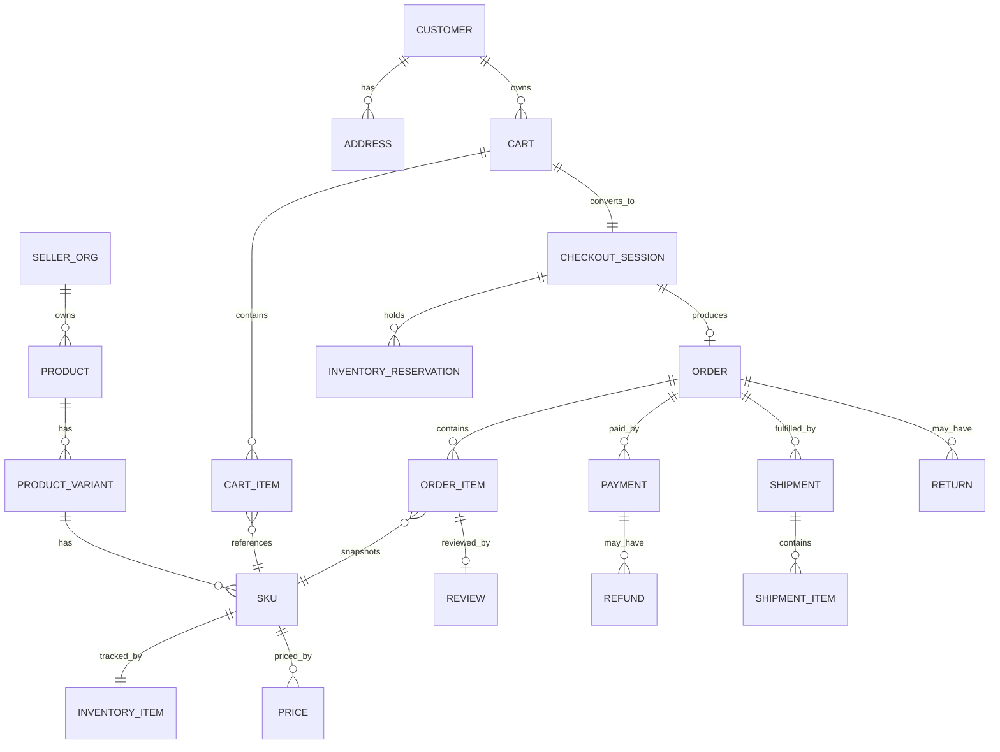

# Data Architecture

PostgreSQL (via Prisma) is the sole authoritative transactional datastore unless explicitly stated otherwise (Search/OpenSearch and Redis are derived/ephemeral per `04-domain-ownership-matrix.md`; see ADR-0002 for the rationale).

## 1. Identifier & Timestamp Conventions

See `28-cross-cutting-contracts.md` for the full normative spec. Summary: all primary keys are UUIDv7 (time-orderable), stored as Postgres `uuid`; all timestamps are `timestamptz` in UTC, serialized as ISO-8601 with `Z` suffix over the API.

## 2. Aggregate Roots and Critical Entities

| Aggregate Root | Key Fields (non-exhaustive) | Owning Domain | Identity | Lifecycle | Relationships | Invariants | Indexing Needs | Retention | Privacy Sensitivity |
|---|---|---|---|---|---|---|---|---|---|
| `User` | id, email (unique), passwordHash, mfaEnabled, status | Identity & Access | UUID | create → verify → active → suspended/deleted | 1—1 `CustomerProfile` or `SellerUser`/`AdminUser` role | email unique while active | unique index on lower(email) | Retained per account lifecycle + legal hold; deletion anonymizes | High (credentials) |
| `Session` / `RefreshToken` | id, userId, deviceInfo, expiresAt, revokedAt | Identity & Access | UUID | issue → active → revoked/expired | many-to-1 `User` | cannot be used after `revokedAt`/`expiresAt` | index on userId, expiresAt | Short (30–90d) | Moderate |
| `CustomerProfile` | id, userId, displayName | Customer | UUID | create → active → closed | 1—1 `User`; 1—many `Address` | one active profile per user | index on userId | Retained per account | High (PII) |
| `Address` | id, customerId, line1, city, region, postalCode, country, isDefault | Customer | UUID | add → (used by orders as snapshot) → remove | many-1 `CustomerProfile` | at most one default per type (shipping/billing) | index on customerId | Retained per account | High (PII) |
| `SellerOrganization` | id, legalName, status (pending/verified/suspended), stripeConnectAccountId | Seller | UUID | create → verify → active → suspended | 1—many `SellerUser`, `Storefront`, `Product` | must be verified to publish/receive payouts | unique index on legalName+taxId combination as applicable | Retained (business record) | Moderate (business PII) |
| `SellerUser` | id, sellerOrgId, userId, role (owner/admin/staff) | Seller | UUID | invite → active → removed | many-1 `SellerOrganization`, many-1 `User` | unique (sellerOrgId, userId) | index on sellerOrgId | Retained | Moderate |
| `Storefront` | id, sellerOrgId, slug (unique), name, description | Seller | UUID | create → publish → update | 1—1 `SellerOrganization` | slug globally unique | unique index on slug | Retained | Low |
| `Category` | id, parentId (nullable), name, slug | Catalog | UUID | create → active → archived | tree via parentId | no cycles | index on parentId, slug | Retained | Low |
| `Product` | id, sellerOrgId, categoryId, title, status (draft/published/unpublished/suspended) | Catalog | UUID | draft → published ↔ unpublished; suspended by moderation | many-1 `SellerOrganization`, many-1 `Category`; 1—many `ProductVariant` | must have ≥1 sellable `Sku` to publish | index on sellerOrgId, categoryId, status | Retained + versioned via audit | Low (public once published) |
| `ProductVariant` | id, productId, attributesJson | Catalog | UUID | create → active → archived | 1—many `Sku` | unique attribute combination per product | index on productId | Retained | Low |
| `Sku` | id, variantId, code (unique per seller), barcode | Catalog | UUID | create → active → discontinued | 1—1 `InventoryItem`, 1—1 current `Price` | code unique within sellerOrgId | unique index on (sellerOrgId, code) | Retained | Low |
| `Price` | id, skuId, currency, amountMinorUnits, effectiveFrom, effectiveTo (nullable) | Pricing | UUID | create → active → expired | many-1 `Sku` | exactly one row with `effectiveTo IS NULL` per (skuId, currency) at a time | unique partial index on (skuId, currency) where effectiveTo IS NULL | Full history retained | Low |
| `Promotion` / `Coupon` | id, type, rulesJson, startsAt, endsAt, redemptionLimit, redemptionCount | Pricing | UUID | create → active → expired | referenced by Checkout at evaluation time | redemptionCount ≤ redemptionLimit (transactional increment) | index on code (coupon) | Retained | Low |
| `InventoryItem` | id, skuId (unique), onHand, reserved, committed, version | Inventory | UUID | create → track (mutated via commands only) | 1—1 `Sku` | available = onHand − reserved − committed ≥ 0 | unique index on skuId; `version` for optimistic locking | Retained | Low |
| `InventoryReservation` | id, inventoryItemId, checkoutSessionId, quantity, expiresAt, status | Inventory | UUID | create → committed/released/expired | many-1 `InventoryItem`, 1—1 `CheckoutSession` | quantity ≤ available at creation | index on inventoryItemId, expiresAt, status | Short-lived, archived after resolution | Low |
| `InventoryAdjustment` | id, inventoryItemId, delta, reason, actorId | Inventory | UUID | append-only | many-1 `InventoryItem` | immutable | index on inventoryItemId, createdAt | Retained (audit) | Low |
| `Cart` | id, customerId (nullable for guest), guestToken (nullable), status | Cart | UUID | active → converted/expired | 1—many `CartItem` | one active cart per customer/guest token | index on customerId, guestToken | Short-lived (expire ~30d inactive) | Low |
| `CartItem` | id, cartId, skuId, quantity | Cart | UUID | add → update → remove | many-1 `Cart` | quantity > 0 | index on cartId | Short-lived | Low |
| `CheckoutSession` | id, cartId, customerId, status, idempotencyKey (unique), totalsJson | Checkout | UUID | started → ... → completed/failed/expired | 1—1 `Cart` snapshot; produces 0..1 `Order` | unique idempotencyKey; at most one resulting `Order` | unique index on idempotencyKey | Short-lived, archived | Moderate (totals) |
| `Order` | id, customerId, sellerOrgId (or split per seller — see note below), status, placedAt | Order | UUID | created → (payment/fulfillment projections update status) → closed/cancelled | 1—many `OrderItem`; 1—many `Payment`, `Shipment`, `Return` | immutable line items post-creation | index on customerId, sellerOrgId, placedAt, status | Retained (financial/legal record, 7y+ per jurisdiction) | Moderate (financial PII) |
| `OrderItem` | id, orderId, sellerOrgId, skuId, productSnapshotJson, unitPriceMinorUnits, quantity, taxMinorUnits | Order | UUID | created (immutable) | many-1 `Order` | snapshot fields never mutated | index on orderId, sellerOrgId | Retained with `Order` | Low |
| `Payment` | id, orderId, provider ("stripe"), providerRef, status, amountMinorUnits | Payment | UUID | created → authorized → captured/failed/cancelled | many-1 `Order` | status transitions only via verified provider event | unique index on (provider, providerRef); index on orderId | Retained (financial record) | High (financial) |
| `Refund` | id, paymentId, amountMinorUnits, status, reason | Payment | UUID | created → processed/failed | many-1 `Payment` | amount ≤ remaining captured amount | index on paymentId | Retained | High (financial) |
| `Shipment` | id, orderId, sellerOrgId, carrier, trackingNumber, status | Fulfillment | UUID | created → shipped → delivered/exception | many-1 `Order`; 1—many `ShipmentItem` | shipped quantities ≤ ordered quantities | index on orderId, trackingNumber | Retained | Moderate (address linkage) |
| `Return` | id, orderId, shipmentId, status, reason | Fulfillment | UUID | requested → authorized → received → refunded | many-1 `Order`, `Shipment` | must reference delivered shipment | index on orderId | Retained | Low |
| `Review` | id, productId, customerId, orderItemId, rating, body, status | Review | UUID | submitted → published/removed | many-1 `Product`; references `OrderItem` for verification | one review per (customerId, orderItemId) | index on productId, customerId | Retained | Low |
| `NotificationPreference` | id, userId, channel, category, enabled | Notification | UUID | update in place | many-1 `User` | unique (userId, channel, category) | index on userId | Retained | Low |
| `NotificationLog` | id, userId, channel, templateId, status, sentAt | Notification | UUID | append-only | many-1 `User` | idempotent per (eventId, channel) | index on userId, sentAt | Bounded retention (90–180d), then aggregated/deleted | Moderate (contact metadata) |
| `MediaAsset` | id, ownerType, ownerId, storageKey, status (pending/processed/failed), variantsJson | Media | UUID | upload → scan → process → publish/reject | polymorphic reference from Catalog/Review/Seller | storageKey unique | index on ownerType, ownerId | Retained while referenced; orphan cleanup job | Low–Moderate |
| `AuditLogEntry` | id, actorId, actorType, action, targetType, targetId, resultStatus, occurredAt, metadataJson | Administration | UUID | append-only | references any entity by (targetType, targetId) | immutable | index on targetType+targetId, actorId, occurredAt | Long retention (compliance, 3–7y) | Moderate (may reference PII by ID only) |
| `ModerationCase` | id, subjectType, subjectId, status, assignedTo | Moderation | UUID | opened → in review → resolved | polymorphic reference | one open case per subject at a time (recommended) | index on subjectType+subjectId, status | Retained | Low |
| `RiskSignal` / `AbuseCase` | id, subjectType, subjectId, score, signalsJson, status | Fraud & Abuse | UUID | created → resolved | polymorphic reference | — | index on subjectType+subjectId | Retained (bounded, compliance-driven) | Moderate |

**Note on `Order` seller scope:** a single checkout may include Skus from multiple sellers. Architecturally, one `Order` (customer-facing, single payment) contains `OrderItem`s tagged with `sellerOrgId`; downstream seller-facing views, fulfillment, and payout logic operate on the seller-scoped subset of `OrderItem`s ("sub-order" view), never on a separate physical `Order` row per seller. This avoids duplicating payment/tax logic while preserving seller data isolation (a seller's API access to `Order` is always filtered to `OrderItem.sellerOrgId = own`).

## 3. Entity Relationship Diagram (Core Purchase Path)

## 4. Data Lifecycle Summary

| Category | Creation | Modification | Archival | Deletion | Anonymization |
|---|---|---|---|---|---|
| Credentials/PII | On registration/order | User-initiated updates | N/A | On verified account-deletion request, subject to legal/financial retention holds | Order/audit records retain non-PII fields; PII fields nulled/tokenized |
| Catalog | Seller authored | Seller authored | Archived on discontinue | On seller account closure after retention window | N/A (not PII) |
| Financial (Order/Payment/Refund) | System-generated at checkout/payment | Status transitions only, no content edits | Never fully deleted within legal retention window | Not deletable within retention window | PII fields (addresses) anonymized after retention window per `18-privacy-architecture.md` |
| Audit logs | System-generated per action | Append-only | Cold-storage after active window | Not deletable within compliance window | Referenced PII resolved by ID only, not duplicated |
| Search index | Derived | Derived | N/A (rebuildable) | Deleted/rebuilt freely | N/A |
