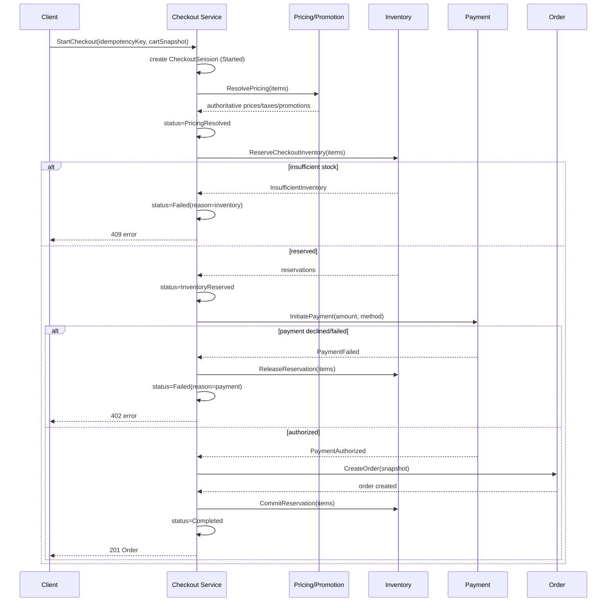

# Aggregate & Transaction Boundaries

## 1. Principles

- **No distributed transactions.** Every step below commits within a single PostgreSQL transaction scoped to one aggregate/domain. Cross-domain consistency is achieved via the saga pattern (explicit compensation) plus the transactional outbox (`10-outbox-architecture.md`) for reliable event emission.
- **Idempotency keys** are required on every client-initiated write that mutates money, inventory, or order state, supplied by the client and stored server-side with the resulting response, so retries return the original result rather than re-executing.
- **Optimistic concurrency** (a `version` integer column) is the default concurrency control; **pessimistic locking** (`SELECT ... FOR UPDATE`) is used only for the `InventoryItem` reservation path where contention is expected to be high and retry storms from optimistic failures would be worse than brief lock waits.

## 2. Critical Operations

### 2.1 Inventory Reservation
- **Transaction boundary:** Single transaction against `InventoryItem` + `InventoryReservation` for one Sku at a time.
- **Concurrency approach:** `SELECT ... FOR UPDATE` on the `InventoryItem` row, recompute `available`, insert `InventoryReservation` if sufficient, update `reserved`, commit. Chosen over optimistic retry because reservation attempts spike simultaneously on popular Skus (flash sales) and optimistic retry storms would amplify contention.
- **Idempotency:** Reservation request carries `checkoutSessionId` + `skuId` as a natural idempotency key (unique constraint) — a retried reservation call for the same checkout/sku is a no-op returning the existing reservation.
- **Retry behavior:** Lock-wait timeout (e.g., 2s) then fail fast with a retryable error to the caller (Checkout), which surfaces "high demand, please retry" rather than queuing indefinitely.
- **Failure behavior:** On insufficient stock, return a typed `InsufficientInventory` error; no partial reservation is ever created.
- **Consistency model:** Strong.
- **Reconciliation:** A scheduled job sweeps `InventoryReservation` rows past `expiresAt` in status `active` and releases them transactionally; this is the safety net for abandoned checkouts.

### 2.2 Cart Updates
- **Transaction boundary:** Single transaction per `Cart` mutation.
- **Concurrency approach:** Optimistic (`version` column) — cart conflicts are low-stakes and rare (single customer, mostly single device).
- **Idempotency:** Not required for add/update (naturally idempotent by resulting state) but `MergeGuestCart` on login uses an idempotency key to avoid duplicate merges.
- **Consistency model:** Strong, low criticality.

### 2.3 Checkout Session Creation & Progression
- **Transaction boundary:** Each state-machine step (`ResolvePricing`, `ReserveCheckoutInventory`, `InitiatePayment`, `CompleteCheckout`) is its own local transaction against the domain it touches; `CheckoutSession.status` is updated transactionally as part of each step's own commit.
- **Concurrency approach:** Optimistic on `CheckoutSession.version`; a session can only be advanced by the step that expects its current status (enforced by a `WHERE status = :expected` guard).
- **Idempotency:** `CheckoutSession.idempotencyKey` (client-supplied, unique) is the outer idempotency boundary — a retried `StartCheckout` call for the same key returns the existing session rather than creating a second one.
- **Retry behavior:** Each step is safely retryable — e.g., re-invoking `ReserveCheckoutInventory` after a network timeout checks for an existing reservation for this `checkoutSessionId` before creating a new one.
- **Failure behavior:** On any step failure, previously completed steps are compensated: inventory reservations are released, payment intents are cancelled, and `CheckoutSession.status = Failed` with a reason code — never left in an ambiguous intermediate state past a short (seconds) processing window.
- **Consistency model:** Saga (sequence of local transactions + compensation), not distributed.

### 2.4 Order Creation
- **Transaction boundary:** Single transaction creating `Order` + all `OrderItem` rows, invoked only by `CompleteCheckout` after payment authorization succeeds.
- **Concurrency approach:** N/A (single writer path — Checkout).
- **Idempotency:** `Order` has a unique FK to `CheckoutSession.id`; re-invocation of `CompleteCheckout` for an already-completed session is a no-op returning the existing `Order`.
- **Failure behavior:** If `Order` creation fails after payment authorization, the checkout enters a `Failed(reconciliationRequired)` state and a high-priority reconciliation job/alert fires — payment is never left captured without a corresponding order without operator visibility.
- **Consistency model:** Strong.

### 2.5 Order State Transitions (status projection)
- **Transaction boundary:** Each contributing domain (Payment, Fulfillment) commits its own state transition, then publishes an event; the `Order` read-projection is updated in its own transaction upon consuming that event.
- **Idempotency:** Projection updates are keyed by `(orderId, sourceEvent.id)` — duplicate event delivery is a no-op.
- **Consistency model:** Eventually consistent (bounded lag, typically sub-second in normal operation).

### 2.6 Payment State Transitions
- **Transaction boundary:** Local transaction on `Payment` per transition, driven by either (a) a synchronous Stripe API response during `InitiatePayment`, or (b) a verified inbound webhook.
- **Concurrency approach:** Optimistic (`version`); webhook handler upserts by `(provider, providerRef)` unique constraint.
- **Idempotency:** Stripe webhook `event.id` is stored and checked before processing — duplicate webhook deliveries are no-ops. Refund creation carries a client-supplied idempotency key passed through to Stripe's own idempotency-key header.
- **Failure behavior:** Webhook signature failures are rejected (400) and alerted, never silently accepted.
- **Consistency model:** Strong locally; reconciled against Stripe's own record via a scheduled reconciliation job comparing local `Payment.status` against a periodic Stripe API poll for any payment not confirmed within an SLA window.

### 2.7 Refund Creation
- **Transaction boundary:** Local transaction on `Payment`/`Refund`, followed by an outbound Stripe refund call; local `Refund.status = pending` until the corresponding webhook confirms.
- **Idempotency:** Client-supplied key + Stripe idempotency key.
- **Consistency model:** Strong locally for the request record; eventually consistent for provider confirmation.

### 2.8 Shipment State Transitions
- **Transaction boundary:** Local transaction on `Shipment`/`ShipmentItem` per transition; quantity checks against `OrderItem` enforced in the same transaction.
- **Idempotency:** Carrier webhook events deduplicated by `(carrier, trackingNumber, eventTimestamp)`.
- **Consistency model:** Strong locally; tracking-status updates eventually consistent via provider webhook.

### 2.9 Return Authorization & Restock
- **Transaction boundary:** `RequestReturn`/`AuthorizeReturn`/`ReceiveReturn` are separate local transactions on `Return`; `ReceiveReturn` additionally invokes Inventory's `RestockFromReturn` command as a second local transaction, coordinated by an outbox event (`ReturnReceived` → Inventory consumer), not a single cross-aggregate transaction.
- **Consistency model:** Saga; restock is eventually consistent relative to the return receipt (bounded lag, monitored).

### 2.10 Seller Inventory Bulk Updates
- **Transaction boundary:** Each `InventoryAdjustment` is its own transaction against one `InventoryItem`; bulk operations (e.g., CSV import) are decomposed into per-row transactions processed by a queue worker, not one giant transaction, so a single bad row cannot roll back an entire batch.
- **Idempotency:** Each row of a bulk import carries a client-supplied batch-row id to prevent duplicate application on retry.
- **Consistency model:** Strong per-row; batch-level completion is eventually consistent and reported via a job-status resource.

## 3. Checkout Workflow Detail (Ordering & Compensation)

**Stale-price/stale-inventory prevention:** `ResolvePricing` always re-reads authoritative `Price` rows — the cart's displayed price is never trusted. **Duplicate-checkout prevention:** the unique `idempotencyKey` on `CheckoutSession` guarantees `StartCheckout` retries converge on one session. **Duplicate-order prevention:** the unique FK from `Order` to `CheckoutSession.id` guarantees `CompleteCheckout` retries converge on one order. **Payment/order inconsistency prevention:** `Order` is created only after `PaymentAuthorized`, and any failure between authorization and order creation triggers a reconciliation alert rather than a silent inconsistency (§2.4).
