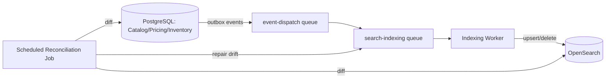

# Search Architecture

## 1. Role

OpenSearch holds a **derived, read-optimized** projection of published catalog data. It is never the source of truth and must always be fully reconstructable from PostgreSQL.

## 2. Index Structure

- One primary index alias `products` pointing to a versioned physical index (`products_v{n}`), enabling zero-downtime reindex-and-swap.
- Document shape (representative): `{ productId, sellerOrgId, title, description, categoryPath[], attributes{}, priceRangeMinorUnits{min,max}, currency, availability (in_stock|limited|out_of_stock), avgRating, reviewCount, status, publishedAt, updatedAt }`.
- Availability is a derived enum computed from Inventory's `available` quantity at indexing time — not a live read at query time — so search stays fast; checkout always re-validates true availability regardless of what search shows.

## 3. Indexing Pipeline

- **Triggers:** `catalog.product_published.v1`, `product_unpublished.v1`, `product_updated.v1`, `pricing.price_changed.v1`, `inventory.*` (availability recompute), `review.submitted.v1`/removed (rating recompute).
- **Worker behavior:** on each job, re-reads the current authoritative state from Postgres (never trusts the event payload as the final value) and upserts the full document — this makes replays and out-of-order delivery safe by construction.
- **Retry/replay:** per `11-queue-architecture.md` (`search-indexing` queue); failures dead-letter and are visible to the reconciliation job.
- **Rebuild:** a full reindex job paginates all published products from Postgres directly (bypassing the event pipeline) into a new `products_v{n+1}` index, then the alias is atomically swapped — used for schema changes or detected significant drift.
- **Schema evolution:** new fields are added via a new physical index version; old-version documents are backfilled during the rebuild, never patched in place across incompatible mappings.

## 4. Deleted / Unpublished Products

`product_unpublished.v1` and moderation-forced unpublish both trigger a document delete (or a `status=unpublished` field flip filtered out of default query results) — the indexing worker treats "no longer published" identically regardless of *why*, keeping search filtering logic simple (`WHERE status = 'published'` equivalent as a persistent filter clause on every query).

## 5. Query Capabilities

- Full-text match on `title`/`description` (BM25 relevance).
- Filters: category, attributes, price range, availability, rating.
- Facets: category counts, attribute-value counts within the current filtered set.
- Sorting: relevance (default), price asc/desc, rating, newest.
- Pagination: `search_after`-based cursor, consistent with the API's cursor pagination convention (`07-api-architecture.md`).

## 6. Staleness Tolerance

Indexing lag SLO: p99 < 30 seconds from event emission to document visibility. Search results may lag reality by this bound; this is disclosed as acceptable (the UI does not promise real-time inventory truth from search results — checkout is authoritative). Lag is monitored via `search_indexing_lag_seconds` and alerted above SLO.

## 7. Availability of the Transactional System

Search unavailability degrades the "browse/search" experience (fallback: category-browse via a simple Postgres query with basic filtering, clearly slower/less featureful) but never blocks cart, checkout, order, or payment operations — those never query OpenSearch.
