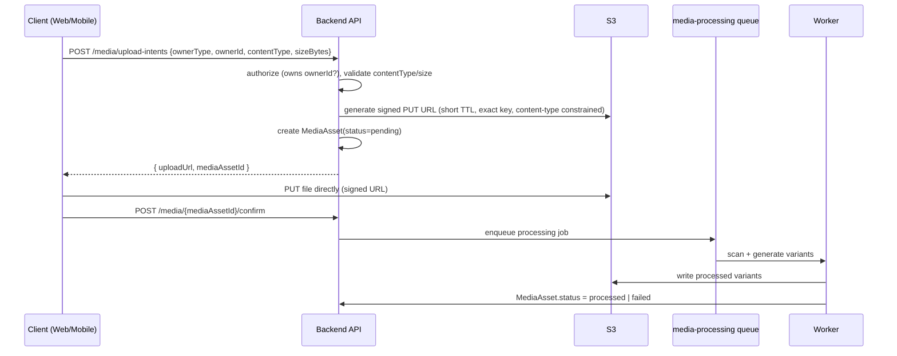

# Media Architecture

## 1. Ownership

`MediaAsset` (Media domain) owns metadata; raw bytes live in S3, never in Postgres. Catalog, Review, and Seller reference media only by `MediaAsset.id` — never by raw storage key — per `04-domain-ownership-matrix.md`.

## 2. Upload Flow

- Clients never receive raw S3 credentials — only short-lived, key-scoped, content-type-constrained signed URLs.
- The client uploads directly to S3 (not proxied through the backend) to avoid the API tier handling large binary payloads.

## 3. Validation & Security

- **File-type validation:** allowed MIME types enforced both client-side (UX) and server-side (signed URL content-type constraint + post-upload magic-byte verification by the worker) — never trust the client-declared type alone.
- **Size restrictions:** enforced via signed URL policy (max content length) and re-verified post-upload.
- **Malware/security scanning:** every upload is scanned (e.g., ClamAV or a managed scanning service) before `status` can move to `processed`; a failed scan sets `status=failed` and never serves the asset.
- **Storage layout:** `s3://{bucket}/{ownerType}/{ownerId}/{mediaAssetId}/original.{ext}` and `.../{variant}.{ext}` for derived sizes — predictable, access-controllable by prefix.

## 4. Processing

- Image variants (thumbnail, medium, large) generated asynchronously via the `media-processing` queue; original is retained separately from derived variants so reprocessing (e.g., new thumbnail size added later) never requires re-upload.
- Video (if supported for product media) is transcoded to a small set of standard renditions; processing failures do not block the rest of the catalog listing from being usable — the asset shows a "processing" or "unavailable" state.

## 5. Delivery

- Published, processed assets are served through the CDN with long cache TTLs (immutable content-addressed-ish keys — a new upload gets a new `mediaAssetId`, never overwrites an existing key).
- Non-public assets (e.g., seller verification documents) are served via short-lived signed GET URLs, never through the public CDN path.

## 6. Lifecycle & Cleanup

- Orphaned `MediaAsset` rows (upload intent created but never confirmed, or owner entity deleted) are cleaned up by the `scheduled-cleanup` queue after a grace period, deleting both the metadata row and the S3 objects.
- Quota management: per-seller storage quota tracked as an aggregate on `SellerOrganization` (updated transactionally alongside `MediaAsset` creation/deletion), enforced at upload-intent time.
