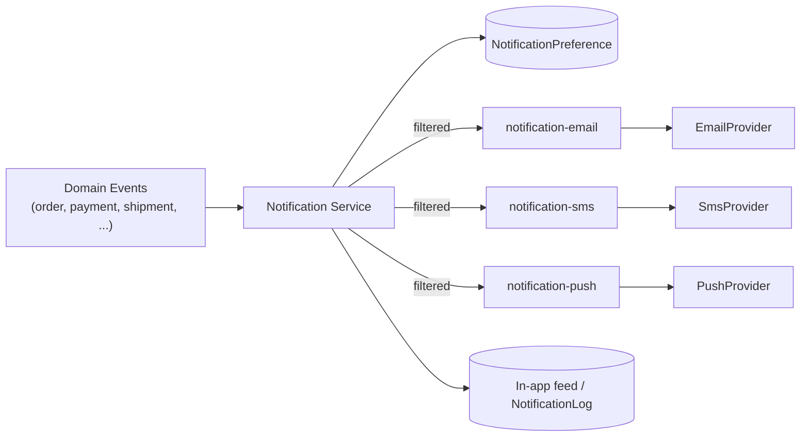

# Notification Architecture

## 1. Channels

Email, SMS, push (FCM/APNs), and in-app (stored notification feed, delivered via the realtime WebSocket/SSE channel per `07-api-architecture.md` §11).

## 2. Flow

Every domain emits business events (per `09-event-architecture.md`); the Notification domain is a terminal consumer that maps `(eventType, userId)` → applicable templates, filtered by `NotificationPreference`, and enqueues channel-specific jobs (`notification-email`, `notification-sms`, `notification-push`) per `11-queue-architecture.md`.

## 3. Preferences

`NotificationPreference` is keyed `(userId, channel, category)` (category e.g. `order_updates`, `marketing`, `security_alerts`). Security/account-critical categories (password reset, MFA, payment confirmation) cannot be fully disabled — they can only be restricted to a single always-on channel (email), preventing users from accidentally losing account-recovery capability.

## 4. Templates

Templates are versioned, localized resources keyed by `(templateId, locale)`, rendered server-side (never client-constructed) to guarantee consistent, reviewed content and to avoid injecting business data into a client-controlled rendering path.

## 5. Delivery Reliability

- At-least-once delivery with deduplication: before enqueueing, the Notification service writes a `NotificationLog` row keyed by `(eventId, channel)` with a unique constraint — a duplicate event delivery that already produced a log row is a no-op, preventing double-sends.
- Retries/backoff/dead-letter per `11-queue-architecture.md`.
- **Provider failure never blocks the originating transactional workflow** — e.g., if the email provider is down, order creation and payment capture still succeed; the notification job retries independently and the failure is visible only in notification-delivery metrics.

## 6. Rate Limits & Abuse

- Per-user, per-category send caps (Redis token bucket) to prevent notification storms from a bug or retry loop.
- SMS is treated as the most cost- and abuse-sensitive channel — restricted to OTP/security and a small allowlist of high-value transactional categories.

## 7. Localization

Template selection includes locale resolved from `User`/`CustomerProfile` preference, falling back to a platform default; content is never machine-translated at send time — translations are pre-authored per supported locale.

## 8. Auditability

`NotificationLog` records `(eventId, channel, templateId, recipientHash, status, sentAt)` — the recipient address/number itself is stored hashed or truncated in the log for audit correlation without duplicating full PII into a second table (full contact info remains solely owned by Customer/Identity domains).
